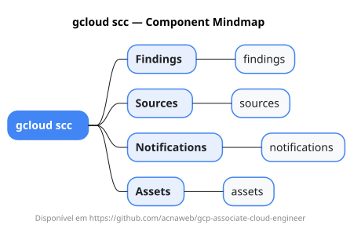

# gcloud scc

Mapa mental do component `scc`.

## Diagrama

## Fonte PlantUML

[scc.puml](./scc.puml)

## Entities / subgrupos representados

- `findings`
- `sources`
- `notifications`
- `assets`

> O mapa prioriza os grupos e entidades mais úteis para estudo e navegação mental da CLI. Alguns nós podem representar subgrupos intermediários da árvore real do `gcloud`.
