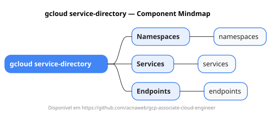

# gcloud service-directory

Mapa mental do component `service-directory`.

## Diagrama

## Fonte PlantUML

[service-directory.puml](./service-directory.puml)

## Entities / subgrupos representados

- `namespaces`
- `services`
- `endpoints`

> O mapa prioriza os grupos e entidades mais úteis para estudo e navegação mental da CLI. Alguns nós podem representar subgrupos intermediários da árvore real do `gcloud`.
