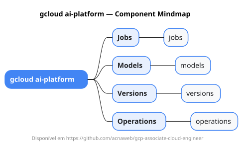

# gcloud ai-platform

Mapa mental do component `ai-platform`.

## Diagrama

## Fonte PlantUML

[ai-platform.puml](./ai-platform.puml)

## Entities / subgrupos representados

- `jobs`
- `models`
- `versions`
- `operations`

> O mapa prioriza os grupos e entidades mais úteis para estudo e navegação mental da CLI. Alguns nós podem representar subgrupos intermediários da árvore real do `gcloud`.
