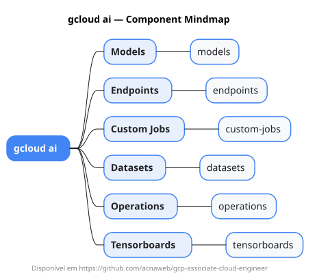

# gcloud ai

Mapa mental do component `ai`.

## Diagrama

## Fonte PlantUML

[ai.puml](./ai.puml)

## Entities / subgrupos representados

- `models`
- `endpoints`
- `custom-jobs`
- `datasets`
- `operations`
- `tensorboards`

> O mapa prioriza os grupos e entidades mais úteis para estudo e navegação mental da CLI. Alguns nós podem representar subgrupos intermediários da árvore real do `gcloud`.
